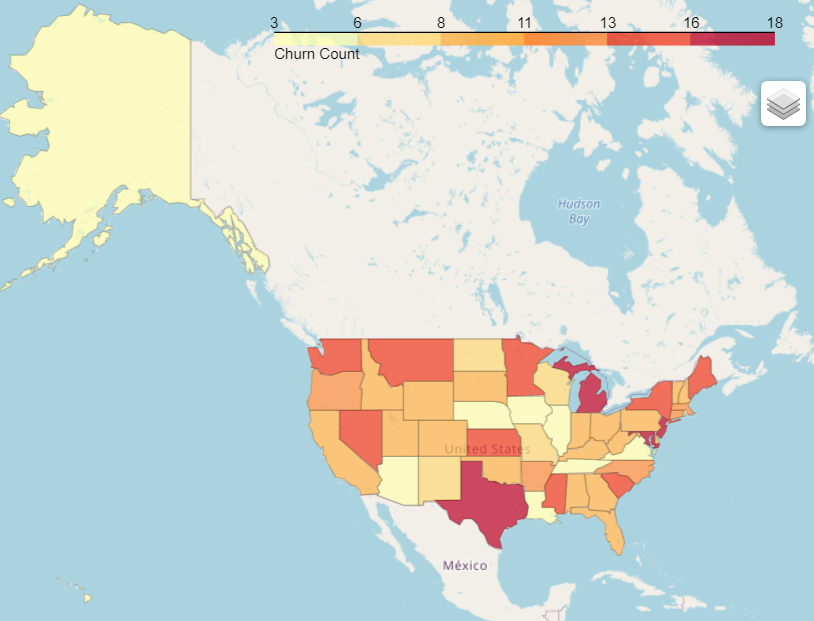
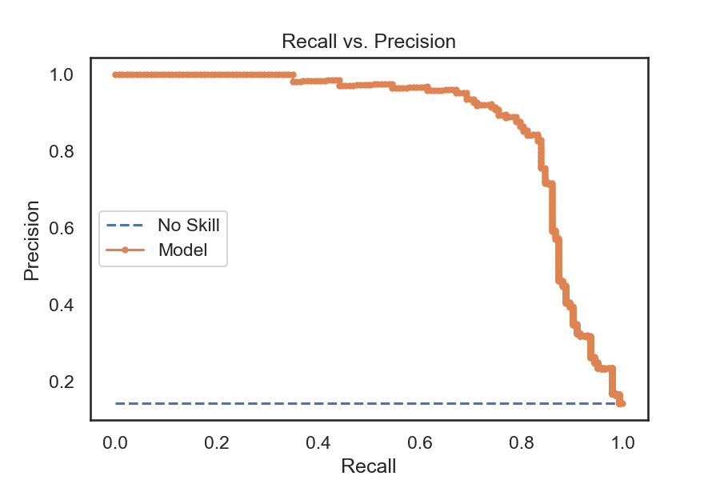
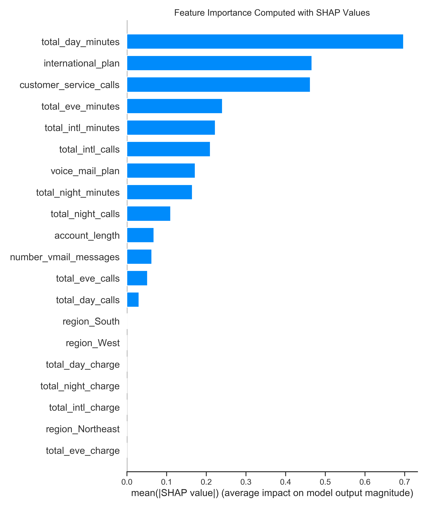
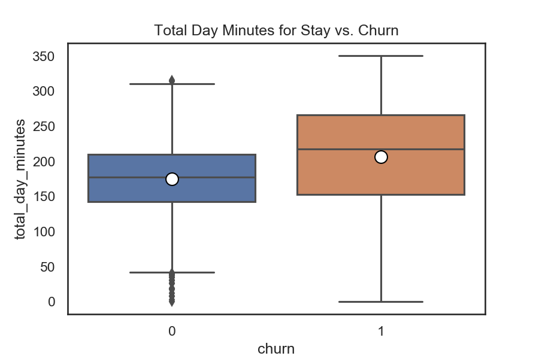
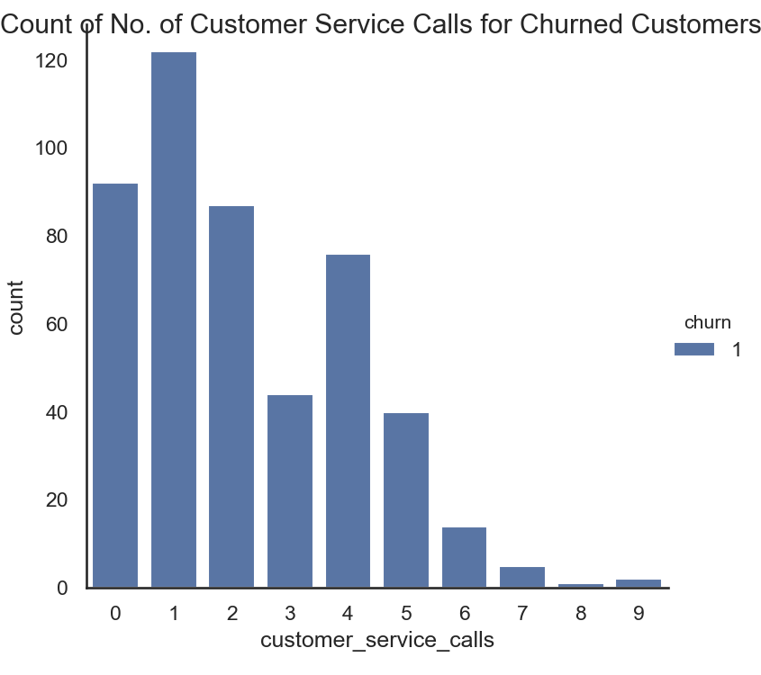
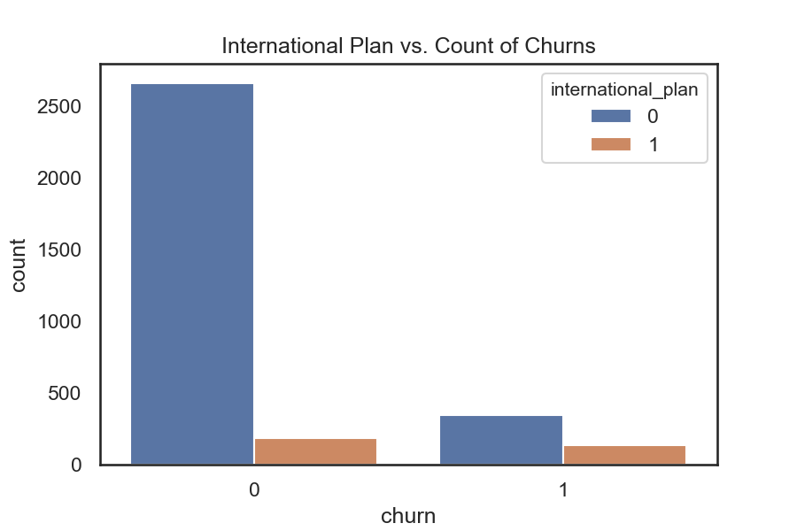

# Phase 3 Project - SyriaTel Customer Churn Dataset

## Final Project Submission

* Student name: Catherine Fritz
* Student pace: part time
* Scheduled project review date: February 19, 2021
* Instructor name: Amber Yandow

### Business Understanding
SyriaTel, a telecommunications company, has compiled data on their customers and whether or not they have stopped doing business, or churned, with SyriaTel. Since it is costly to lose customers, the goal is to use this data to identify customers that are likely to churn, and take measures to keep them from doing so.

### Data Understanding
The dataset provided information on the following features for each customer:
* US State
* Length of account
* Area code + phone numbers
* If the customer has an international plan
* If the customer has a voicemail plan
* No. of voicemail messages
* Breakdown of call minutes for day, evening, night, and international
* Breakdown of call charges for day, evening, night, and international
* Breakdown of no. of calls for day, evening, night, and international
* No. of calls to customer service
* If they have churned

#### EDA
I wanted to see if there might be a trend in the certain states churning more than others, so I plotted the no. of churns per state below.

#### Data Preparation
There appear some states with more churns than others, but it warrants further investigation. To be able to use the state data in the below models, a region was assigned to each state to reduce the no. of categories. The regions used are those used by the Census Bureau and are Northeast, Midwest, South, and West.

Consequently, I removed the state feature in favor of the region information. Features that were also removed were area code and phone number since area code was captured in the region, and phone number is simply a customer identifier.

### Modeling & Evaluation
Since the goal is to reduce the number of customer churns, I want to reduce the number of number of customers that leave since they were not identified as a churn risk, or simply, the number false negatives. This means that we want to prioritize recall, but not make the model so inaccurate that all customers are identified as potential churners.

#### Model 1 - Logistic Regression - SKlearn
I tried logistic regression for my first model.
##### Results:
Accuracy:  84.3%
Recall:    16.8%
F1:        18.6%
AUC:       37.2%
Accuracy was not bad, but performed poorly in other metrics, especially recall. Considering logistic regression is better for data that are more continuous, I tried a different classifier.

#### Model 2 - Decision Tree Classifier
Next, I tried a Decision Tree Classifier, trying both Gini Impurity and Information Gain (entropy).
##### Results:
           Gini    Entropy
Accuracy:  91.2%   90.4%
Recall:    93.8%   94.2%
F1:        70.6%   69.5%
AUC:       72.9%   71.7%
Using entropy provided slightly better recall than Gini, however with the sacrifice of some accuracy, F1, and AUC. Either way, this model outperforms logistic regression, but I felt this could still be improved.

#### Model 3 - XGBoost + Grid Search
For my last set of models, I used XGBoost to train gradient-boosted decision trees. I then used a grid search to optimize the parameters to produce an even better model.
##### Results:
           XGB     Grid Search
Accuracy:  94.6%   95.9%
Recall:    77.8%   96.9%
F1:        80.0%   88.0%
AUC:       88.0%   89.7%
The recall was boosted significantly by imposing greater penalties for errors on the minor class, which in this situation is identifying the churners.

The best performing model was the grid search with XGBoost. Below is the decision matrix used to calculate recall and also the Precision-Recall curve used to calculate AUC. PR curve used instead of ROC curve since the classes are imbalanced, as evidenced by the confusion matrix.

recall = True Positives / (True Positives + False Negatives)
= 468 / (468 + 15) = 96.9%

AUC = 89.7%

### Evaluation
I stayed with the boosted model to determine feature importance, and used SHAP (SHapley Additive exPlanations) to determine them:

### Recommendations

### Deployment
For More Information, please review my full analysis in Jupyter Notebook or my presentation.

For any additional questions, please contact Catherine Fritz: cmfritz0@gmail.com.

## Repository Structure
#### Main Page
    ├── README.md                              <- The top-level README for reviewers of this project
    ├── presentation.pdf                       <- PDF version of project presentation
    ├── analysis.ipynb                         <- master notebook
    ├── data                                   <- folder where data exists
    ├── images                                 <- folder where data visualizations and graphics are located

#### Data
    ├── churn_data.csv                         <- churn data .csv file
    ├── state-geocodes.csv                     <- Census regions .csv file

#### images
    ├── .png                                   <- various .png files
